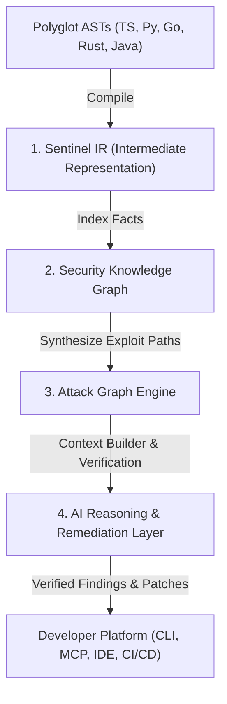
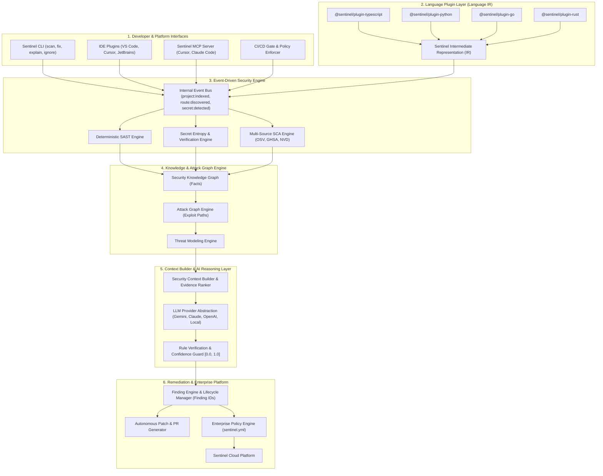
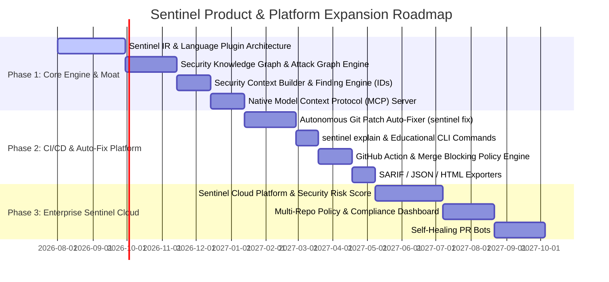

# 🛡️ Sentinel Security Platform: Engineering Architecture & Product Blueprint

---

## 📋 Executive Overview & Agent Handoff Context

This document serves as the **master technical blueprint, product architecture, and agent handoff specification** for the Sentinel Platform. Any AI coding assistant or engineer working on this repository MUST follow this blueprint to maintain the architectural vision, language abstractions, data models, and execution sprints.

---

## 1. Vision & Core Moat

> **Sentinel is an application security platform that combines deterministic program analysis, security graph modeling, and AI-assisted reasoning to identify, verify, and remediate vulnerabilities before software reaches production.**

Unlike traditional scanners that rely solely on pattern-matching regexes or naive LLM prompts, Sentinel builds a robust technical moat around **four core proprietary assets**:



### The Four Moat Pillars
1. **Sentinel IR (Intermediate Representation)**: A language-agnostic intermediate format. AI engines and analysis modules consume Sentinel IR, never raw ASTs or raw code strings.
2. **Security Knowledge Graph**: A semantic fact graph modeling application topology (Routes, Auth Middleware, Validators, DB Queries, Secrets, Assets) without vulnerability assumptions.
3. **Attack Graph Engine**: Derived from the Knowledge Graph, this engine computes plausible multi-step exploit paths, blast radiuses, and attack vectors.
4. **AI Reasoning & Context Builder Layer**: Operates on the Attack Graph via an explicit **Security Context Builder** (Ranking, Evidence Selection, Compression) to explain, verify, prioritize, and generate root-cause fixes.

---

## 2. Current Codebase Context & Baseline State

### Repository Metadata
- **Package Name**: `sentinel-ai-cli` (v1.0.2)
- **Repository Root**: Project Root (`./`)
- **Primary Language**: TypeScript 5.x (Target: Node.js / ES2022)
- **Build System**: `tsc` (Output: `dist/`)
- **Key Dependencies**:
  - `@google/generative-ai` (^0.21.0): Gemini API client
  - `ts-morph` (^28.0.0): TypeScript Compiler API & AST manipulation
  - `fast-glob` (^3.3.3): High-performance file system globbing
  - `commander` (^15.0.0): CLI argument parsing
  - `chalk` (^5.6.2) & `ora` (^9.4.1): Terminal styling & spinners
  - `dotenv` (^16.4.5) & `axios` (^1.6.8)

### Current Directory Structure
```
c:\Users\ggdri\Downloads\NYC-R2-Sentinal\
├── package.json               # Package config & dependencies
├── tsconfig.json              # TypeScript compiler settings
├── README.md                  # Public documentation & hackathon changelog
├── plan.md                    # Master technical architecture & execution blueprint
└── src/
    ├── index.ts               # CLI Entrypoint (commander registration)
    ├── types.ts               # Shared Data models & Interfaces
    ├── ai/                    # AI Provider Integration (llm.ts, prompts.ts)
    ├── commands/              # CLI Action Handlers (attack.ts, set-key.ts)
    ├── core/                  # Engine Orchestrator & Configuration (config.ts, orchestrator.ts)
    ├── events/                # Typed Event-Driven Bus (eventBus.ts)
    ├── findings/              # Finding Store & Persistent Finding IDs (findingStore.ts)
    ├── graph/                 # Security Knowledge Graph & Attack Graph Engine (knowledgeGraph.ts, attackGraph.ts)
    ├── ir/                    # Sentinel Intermediate Representation Spec (types.ts)
    ├── plugins/               # Polyglot Language AST-to-IR Plugins (typescript.ts)
    └── rules/                 # Deterministic Security Rules (secrets.ts, dependencies.ts, routes.ts, project.ts)
```

### Verified Baseline Fixes (Recently Applied)
- **AST Compiler Reuse** ([`src/rules/routes.ts`](file:///c:/Users/ggdri/Downloads/NYC-R2-Sentinal/src/rules/routes.ts)): Reused a single `ts-morph` `Project` instance outside the file loop to resolve CPU/memory leaks. Added support for `.tsx`, `.jsx`, `.mjs`, `.cjs`, template literals, and `all`/`use` methods.
- **Regex Match & Capture Group Fix** ([`src/rules/secrets.ts`](file:///c:/Users/ggdri/Downloads/NYC-R2-Sentinal/src/rules/secrets.ts)): Converted patterns to global `/g` regexes, added `maskSecret()` (`AIza****X9Z`), added false-positive exclusions (`process.env`, `req.body`), and deduplicated line findings.
- **Directory Check & CLI Hint Bugfixes** ([`src/commands/attack.ts`](file:///c:/Users/ggdri/Downloads/NYC-R2-Sentinal/src/commands/attack.ts)): Fixed `isDirectory()` method invocation and updated CLI error hints.
- **Latency & UI Cleanup** ([`src/core/orchestrator.ts`](file:///c:/Users/ggdri/Downloads/NYC-R2-Sentinal/src/core/orchestrator.ts)): Removed 5-second artificial `delay()` calls and corrected secret scanning spinner labels.
- **Environment Variable Fallback** ([`src/core/config.ts`](file:///c:/Users/ggdri/Downloads/NYC-R2-Sentinal/src/core/config.ts)): Added `process.env.GEMINI_API_KEY` and `process.env.GOOGLE_API_KEY` resolution.
- **Model Fallback** ([`src/ai/llm.ts`](file:///c:/Users/ggdri/Downloads/NYC-R2-Sentinal/src/ai/llm.ts)): Configured `gemini-2.5-flash` with graceful fallback to `gemini-2.0-flash` on model-unavailable API errors.

---

## 3. End-State Platform Architecture

Sentinel's architecture is decoupled into an **Event-Driven Architecture** centered around Sentinel IR, Knowledge/Attack Graphs, Context Builders, and Provider Abstractions:



---

## 4. Key Subsystem Specifications

### A. Language Plugins & Sentinel IR (`src/ir/`, `src/plugins/`)
- **Plugin Architecture**: Modular language plugins (`@sentinel/plugin-typescript`, `@sentinel/plugin-python`, etc.).
- **Sentinel IR Schema**:
  - `IRFunction`: Function declarations, parameters, return types, decorators.
  - `IRRoute`: HTTP Method, path, controller reference, middleware chain.
  - `IRCallSite`: Caller, callee, arguments, position.
  - `IRVariable`: Identifiers, scope, string literals, taint flags.

### B. Event-Driven Architecture (`src/events/`)
Instead of linear sequential function calls, Sentinel modules communicate asynchronously over an internal Event Bus (`SentinelEventBus`):
- `project:indexed`
- `route:discovered`
- `secret:detected`
- `dependency:parsed`
- `graph:knowledge_updated`
- `graph:attack_generated`
- `scan:completed`

### C. Security Knowledge Graph vs. Attack Graph (`src/graph/`)
1. **Security Knowledge Graph (`KnowledgeGraph`)**: Stores pure application topology facts (Routes, Auth Middleware, Database Queries, Environment Secrets, Assets) with zero vulnerability assertions.
2. **Attack Graph Engine (`AttackGraphEngine`)**: Operates on the Knowledge Graph to compute plausible multi-step exploit paths:
   $$\text{Unauthenticated Route} \rightarrow \text{Missing Auth Guard} \rightarrow \text{Raw Input} \rightarrow \text{SQL Statement} \rightarrow \text{Exposed S3 Secret}$$

### D. Security Context Builder & LLM Abstraction (`src/ai/`)
1. **Security Context Builder**: Selects relevant code files, ranks evidence, trims context, and packages token-optimized reasoning payloads for the LLM.
2. **LLM Provider Abstraction (`ILlmProvider`)**: Interfaces supporting multiple models:
   - `GeminiProvider` (Primary default)
   - `ClaudeProvider`
   - `OpenAIProvider`
   - `LocalOllamaProvider`
3. **Finding Verification & Confidence Scoring**: Calculates a deterministic confidence score on the scale $[0.0, 1.0]$ based on AST cross-checks, OWASP/CWE mappings, and evidence completeness.

### E. Finding Lifecycle & Process-Local Finding IDs (`src/findings/`)
During each scan execution, issues are assigned process-local Finding IDs (`FINDING-100`, `FINDING-101`) with confidence scores on the scale $[0.0, 1.0]$:
```json
{
  "id": "FINDING-100",
  "uuid": "550e8400-e29b-41d4-a716-446655440000",
  "title": "Unauthenticated SQL Injection in User Export Route",
  "severity": "CRITICAL",
  "confidence": 0.96,
  "ruleId": "SQLI-001",
  "owaspCategory": "A03:2021-Injection",
  "cweId": "CWE-89",
  "evidence": {
    "file": "src/routes/export.ts",
    "line": 42,
    "routePath": "/api/v1/export",
    "httpMethod": "POST"
  }
}
```
In-memory CLI execution workflows (planned persistent finding storage in Sprint 4-5):
- `sentinel explain FINDING-100` (Process-local educational explanation)
- `sentinel fix FINDING-100` (Process-local git patch generation)

### F. Enterprise Policy Engine (`sentinel.yml`)
Allows organizations to enforce custom security policies:
```yaml
version: "1"
policies:
  - id: block-critical-cves
    action: block_ci
    severity: CRITICAL
  - id: enforce-route-auth
    action: flag
    rule: AUTH-REQ-01
  - id: compliance
    frameworks: [OWASP-TOP-10, SOC2-TYPE-2]
```

---

## 5. Multi-Phase Product Roadmap



---

## 6. Technical Comparison Matrix

| Feature / Capability | Legacy SAST (e.g. SonarQube) | Legacy SCA (e.g. Snyk) | Naive LLM Scanners | **Sentinel Platform** |
| :--- | :--- | :--- | :--- | :--- |
| **Analysis Scope** | Static Rules Only | Package Lockfiles Only | Text Prompt Only | **Security & Attack Knowledge Graph** |
| **Intermediate Representation** | Proprietary AST | Package Tree Only | None (Raw Text) | **Sentinel Language-Agnostic IR** |
| **Attack Vector Discovery** | ❌ No | ❌ No | ⚠️ Unreliable | **✅ Yes (Graph Taint Tracing)** |
| **Hallucination Prevention** | N/A | N/A | ❌ High False Positives | **✅ Yes (Rule Verification & Context Builder)** |
| **Finding Lifecycle (IDs)** | Issue Tracking | CVE ID Only | None | **✅ Yes (`FINDING-ID` Process-Local)** |
| **LLM Provider Abstraction** | ❌ No | ❌ No | Hardcoded | **Target / Planned (Sprint 4)** |
| **MCP Server Integration** | ❌ No | ❌ No | ❌ No | **Target / Planned (Sprint 5)** |
| **Enterprise Policy Engine** | Rule Toggles | Ignore Files | None | **Target / Planned (Phase 2)** |

---

## 7. Sprint Guide & Live Implementation Progress Tracker

### Current Status: 🚀 Phase 1 Engine Infrastructure Active

- [x] **Sprint 1: Sentinel IR & Language Plugin Architecture** (`src/ir/`, `src/plugins/`)
  - Created `src/ir/types.ts` defining `IRProject`, `IRFile`, `IRRoute`, `IRFunction`, `IRVariable`, `IRCallSite`.
  - Implemented `@sentinel/plugin-typescript` (`src/plugins/typescript.ts`) to compile AST nodes to Sentinel IR with source file cache cleanup.
- [x] **Sprint 2: Event Bus & Knowledge Graph Engine** (`src/events/`, `src/graph/`)
  - Implemented `SentinelEventBus` (`src/events/eventBus.ts`) with canonical event names (`project:indexed`, `route:discovered`, `secret:detected`, `dependency:parsed`, `graph:knowledge_updated`, `graph:attack_generated`, `scan:completed`).
  - Implemented `KnowledgeGraph` (`src/graph/knowledgeGraph.ts`) for storing topology facts without vulnerability assumptions.
  - Implemented `AttackGraphEngine` (`src/graph/attackGraph.ts`) with BFS multi-hop exploit path traversal.
- [x] **Sprint 3: Finding Lifecycle Engine & Store** (`src/findings/`)
  - Implemented `FindingStore` (`src/findings/findingStore.ts`) generating process-local Finding IDs (`FINDING-100`), confidence scoring on $[0.0, 1.0]$ scale, OWASP/CWE tags, line evidence, and finding deduplication.
- [ ] **Sprint 4: Build Security Context Builder & LLM Abstraction** (`src/ai/`)
  - Target: `src/ai/contextBuilder.ts` to rank evidence and build context windows.
  - Target: `src/ai/providers/` (`gemini.ts`, `claude.ts`, `openai.ts`).
- [ ] **Sprint 5: Sentinel MCP Server** (`src/mcp/`)
  - Target: Implement MCP server using `@modelcontextprotocol/sdk` in `src/mcp/server.ts`.

---

## 8. Verification & Build Commands for Agents

Before completing any task or ending a turn, AI agents MUST execute:
1. **TypeScript Build**:
   ```bash
   npm run build
   ```
2. **Local Attack Test Execution**:
   ```bash
   npm run start -- attack .
   ```
3. **Ensure Zero TS Errors & Clean Log Output**.
