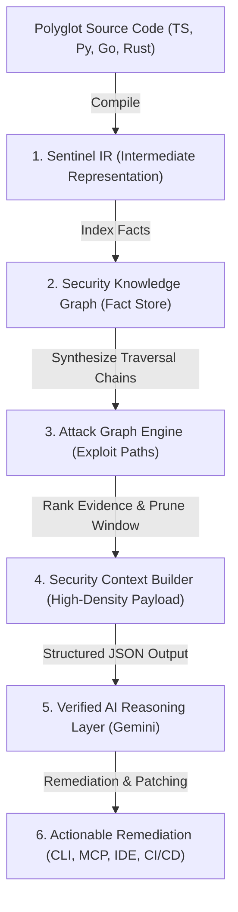
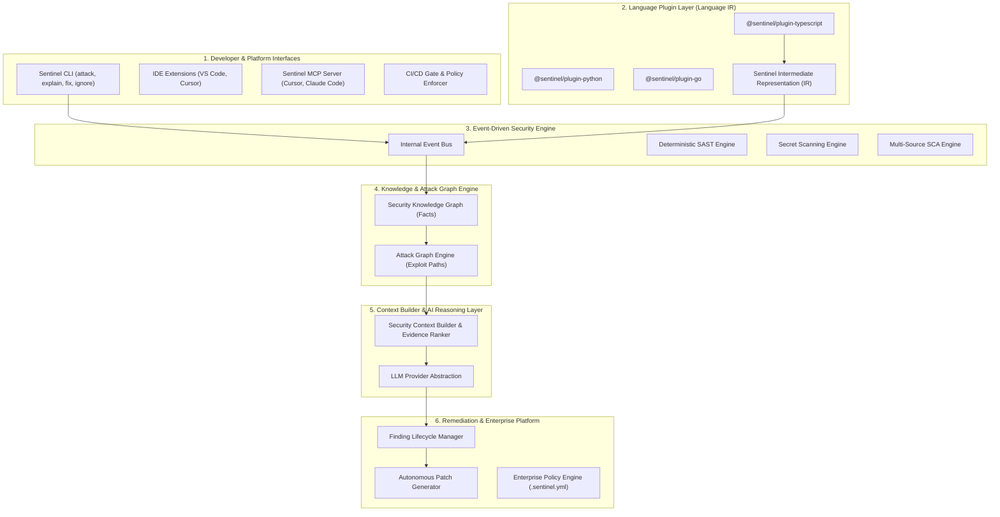

# 🛡️ Sentinel Security Platform: Engineering Architecture & Product Blueprint (v1 Bible)

---

## 📋 Executive Overview

This document serves as the **master technical blueprint, product architecture specification, and engineering handoff guide** for the Sentinel Security Platform. 

Any AI coding assistant or engineer working on this codebase MUST adhere strictly to these architectural principles, intermediate representation contracts, and engineering standards.

---

## 1. Vision & Core Moat

> **Sentinel is an application security platform that combines deterministic program analysis, security graph modeling, and AI-assisted reasoning to identify, verify, and remediate vulnerabilities before software reaches production.**

The primary technical moat of Sentinel is NOT raw LLM prompts or pattern-matching regexes, but the **structured context pipeline** that takes code from raw source to verified remediation:



### Engineering Principles

1. **Deterministic Analysis Before AI Reasoning**: Deterministic AST parsing and graph synthesis establish ground truth facts before any AI LLM invocation.
2. **Polyglot Compilation to Sentinel IR**: AI and security analysis modules consume Sentinel IR contracts, never raw ASTs or raw code strings.
3. **Facts Separated from Attack Hypotheses**: The Knowledge Graph records pure application topology facts; the Attack Graph computes potential exploit hypotheses.
4. **Verifiable Evidence for Every AI Finding**: Every AI finding must be anchored to concrete line numbers, AST call sites, or package versions.
5. **Independently Replaceable Subsystems**: Language plugins, graph engines, context builders, and LLM providers are loosely coupled over typed event interfaces.

---

## 2. Non-Functional Goals: Performance & Security Guarantees

### Performance Targets
- **Incremental Scans**: Under 5 seconds for typical medium-sized repositories.
- **Memory Bounded**: Memory footprint strictly bounded by AST file count, with explicit source file eviction (`tsProject.removeSourceFile()`).
- **Parallel Scanning**: Asynchronous rule execution and non-blocking event dispatching.
- **Scalability**: Linear scalability with project size via language IR caching.

### Security & Privacy Guarantees
- **Secret Masking**: All detected credentials (API keys, tokens) are masked (`AIza****X9Z`) before logging, rendering, or API transmission.
- **Deterministic Verification**: Every AI-generated vulnerability finding must include concrete source file location evidence.
- **Offline SAST Support**: Deterministic AST parsing and secret rules execute locally offline; AI security report reasoning and autonomous fix patch generation require network connectivity for Gemini API calls.
- **Zero Source Code Retention**: No source code or proprietary ASTs are retained or used for model training.

---

## 3. Current Platform (Implemented Prototype)

### Repository & Package Metadata
- **Package Name**: `sentinel-ai-cli` (v1.0.3)
- **Primary Language**: TypeScript 5.x (Node.js ES2022)
- **Build System**: `tsc` (Output: `dist/`)

### Implemented Subsystems (First Iteration / Prototype)
- **Sentinel IR Protocol** (`src/ir/types.ts`): Prototype IR schemas for projects, files, routes, functions, and call sites.
- **TypeScript Plugin** (`src/plugins/typescript.ts`): First iteration AST-to-IR compiler built on `ts-morph`.
- **Event Bus** (`src/events/eventBus.ts`): Decoupled `SentinelEventBus` broadcasting lifecycle events (`project:indexed`, `route:discovered`, `secret:detected`, `dependency:parsed`, `graph:knowledge_updated`, `graph:attack_generated`, `scan:completed`).
- **Knowledge & Attack Graph Prototype** (`src/graph/`): Prototype `KnowledgeGraph` and BFS multi-hop `AttackGraphEngine`.
- **Finding Store & Persistence** (`src/findings/findingStore.ts`): Process-local Finding IDs (`FINDING-100`) with disk persistence (`.sentinel/findings.json`) and typed `FindingStatus` (`OPEN`, `IGNORED`, `FIXED`).
- **Security Context Builder & AI Layer** (`src/ai/contextBuilder.ts`, `src/ai/prompts.ts`, `src/ai/llm.ts`): Evidence ranker, token-optimized context synthesis, CISO-grade OWASP/PTES prompts, and Gemini Structured JSON outputs (`responseMimeType: "application/json"`).
- **Terminal UI/UX Suite** (`src/ui/render.ts`): Pixel-perfect box borders, ANSI length calculation, risk badges, IR & Knowledge Graph topology matrix cards, code diff rendering.
- **CLI Commands**: `sentinel attack`, `sentinel explain <id>`, `sentinel fix <id>`, `sentinel ignore <id>`, `sentinel set-key`.

---

## 4. Sentinel IR Specification (The Polyglot Contract)

Sentinel IR defines the strict intermediate representation contract that every language plugin (`@sentinel/plugin-typescript`, `@sentinel/plugin-python`, `@sentinel/plugin-go`) must fulfill:

- `IRProject`: Root container, project metadata, global symbol map.
- `IRFile`: File path, language identifier, AST root, imported modules.
- `IRRoute`: HTTP Method (GET, POST, etc.), URI path, controller handler reference, middleware chain.
- `IRFunction`: Function signature, parameter types, return type, decorators, AST node bounds.
- `IRClass`: Class declaration, heritage/implements clauses, member methods, properties.
- `IRCall`: Call site expression, caller scope, target function name, arguments.
- `IRVariable`: Variable identifier, scope, initializer type, constant literal value, taint flags.
- `IRImport`: Module specifier, imported symbols, default/namespace alias.
- `IRDependency`: Package name, version range, dependency type (production/dev).
- `IRSecret`: Entropy pattern type, masked value, line location, scope.
- `IRAsset`: Database models, storage buckets, environment config keys.

---

## 5. Security Context Builder (Core Innovation)

The **Security Context Builder** (`src/ai/contextBuilder.ts`) is Sentinel's primary innovation layer. It sits between deterministic graph analysis and LLM reasoning to answer 5 fundamental questions:

1. **Which findings matter?** Ranks findings by CVSS risk density, Attack Graph path length, and unauthenticated exposure.
2. **Which files matter?** Isolates source files directly involved in entrypoint routes, secret reads, or tainted call chains.
3. **Which evidence should be included?** Extracts line numbers, snippet bounds, and method signatures while discarding irrelevant boilerplate.
4. **What can be omitted?** Prunes non-vulnerable devDependencies, unused imports, and unexposed internal functions.
5. **How is the prompt constructed?** Constructs a high-density, token-optimized markdown payload (`formattedContextPrompt`) enforcing CISO-grade OWASP ASVS/PTES analysis rules.

---

## 6. Finding Lifecycle & State Machine

Findings transition through an explicit lifecycle state machine:

```
  Detected ──────► Verified ──────► Explained ──────► Fixed ──────► Resolved
      │                                                │
      └────────────────────────────────────────────────┴──► Ignored
```

### CLI Command Mapping
- **`sentinel attack [target]`**: Triggers scanning, compiles IR, updates Knowledge Graph, synthesizes Attack Graph, builds Security Context, invokes Gemini AI, and sets finding status to `OPEN` / `Verified`.
- **`sentinel explain <finding-id>`**: Transitions finding to `Explained`, displaying deep OWASP root-cause, exploit mechanics, CIA triad impact, and remediation steps.
- **`sentinel fix <finding-id>`**: Generates an autonomous code patch diff, applies the patch, and transitions finding status to `FIXED`.
- **`sentinel ignore <finding-id> --reason <reason>`**: Transitions finding status to `IGNORED` with developer justification.
- **`sentinel verify <finding-id>`** *(Planned)*: Re-runs deterministic rules against the patched file to confirm resolution (`Resolved`).

---

## 7. Observability & Telemetry Subsystem (Planned)

As Sentinel scales to enterprise codebases, full execution visibility is provided via the Telemetry Engine:

- **Structured Logs**: Real-time event bus activity stream (`eventBus.onEvent(...)`).
- **Rule Execution Statistics**: Count of analyzed AST nodes, scanned lines of code, and evaluated regex rules.
- **Graph Metrics**: Node count, edge count, and BFS traversal duration.
- **AI Latency & Token Metrics**: Prompt token count, response latency (ms), model fallback counters (`gemini-2.5-flash` vs `gemini-2.0-flash`).
- **Cache Hit Rates**: AST memory cache hit rates for `ts-morph` Compiler instances.

---

## 8. Target Platform Architecture & Technical Comparison



### Technical Comparison Matrix

| Feature / Capability | Legacy SAST (SonarQube) | Legacy SCA (Snyk) | Naive LLM Scanners | **Sentinel Platform** |
| :--- | :--- | :--- | :--- | :--- |
| **Analysis Scope** | Static Rules Only | Package Lockfiles | Text Prompt Only | **Security Knowledge Graph** |
| **Intermediate Format** | AST | Package Tree | None | **Sentinel Polyglot IR** |
| **Attack Vector Discovery** | ❌ No | ❌ No | ⚠️ Unreliable | **✅ Yes (Graph Taint Tracing)** |
| **Context Optimization** | N/A | N/A | ❌ Raw Prompt | **✅ Yes (Security Context Builder)** |
| **Finding Lifecycle (IDs)** | Issue Tracker | CVE ID | None | **✅ Yes (`FINDING-ID` Storage)** |
| **LLM Provider Abstraction** | ❌ No | ❌ No | Hardcoded | **Prototype (Sprint 4)** |
| **MCP Server Integration** | ❌ No | ❌ No | ❌ No | **Planned (Sprint 5)** |
| **Enterprise Policy Engine** | Rule Toggles | Ignore Files | None | **Planned (Phase 2)** |

---

## 9. Product Roadmap & Sprint Execution Guide

### Roadmap Order
```
Sentinel IR ──► Knowledge Graph ──► Attack Graph ──► Context Builder ──► Auto-Fix ──► GitHub Action ──► MCP Server ──► Cloud
```

### Live Implementation Progress Tracker

- [x] **Sprint 1: Sentinel IR & Language Plugin Architecture** (`src/ir/`, `src/plugins/`)
  - Created `src/ir/types.ts` defining `IRProject`, `IRFile`, `IRRoute`, `IRFunction`, `IRVariable`, `IRCallSite`.
  - Implemented `@sentinel/plugin-typescript` (`src/plugins/typescript.ts`) to compile AST nodes to Sentinel IR.
- [x] **Sprint 2: Event Bus & Knowledge Graph Engine** (`src/events/`, `src/graph/`)
  - Implemented `SentinelEventBus` (`src/events/eventBus.ts`) with canonical event types.
  - Implemented prototype `KnowledgeGraph` (`src/graph/knowledgeGraph.ts`) and BFS `AttackGraphEngine` (`src/graph/attackGraph.ts`).
- [x] **Sprint 3: Finding Lifecycle Engine & Store** (`src/findings/`)
  - Implemented `FindingStore` (`src/findings/findingStore.ts`) generating process-local Finding IDs (`FINDING-100`), confidence scoring on $[0.0, 1.0]$ scale, OWASP/CWE tags, line evidence, and `.sentinel/findings.json` persistence.
- [x] **Sprint 4: Security Context Builder, Structured AI & UI/UX** (`src/ai/`, `src/ui/`)
  - Created `src/ai/contextBuilder.ts` implementing `buildSecurityContext()` for evidence ranking and context synthesis.
  - Created `src/ai/prompts.ts` centralizing all system prompts, Security Context integration, and Gemini JSON Response Schemas (`securityReportSchema`, `explainFindingSchema`, `fixPatchSchema`).
  - Updated `src/ai/llm.ts` to use `responseMimeType: "application/json"` with model fallback (`gemini-2.5-flash` to `gemini-2.0-flash`) and finite request timeouts (`AbortSignal.timeout`).
  - Created `src/ui/render.ts` with custom color palettes, score badges, box cards, banner headers, and high-contrast diff renderers.
- [ ] **Sprint 5: Sentinel MCP Server** (`src/mcp/`)
  - Target: Implement MCP server using `@modelcontextprotocol/sdk` in `src/mcp/server.ts`.

---

## 10. Verification & Build Commands

Before completing any task or ending a turn, AI agents MUST execute:
1. **TypeScript Build**:
   ```bash
   npm run build
   ```
2. **Local Attack Test Execution**:
   ```bash
   npx tsx src/index.ts attack .
   ```
